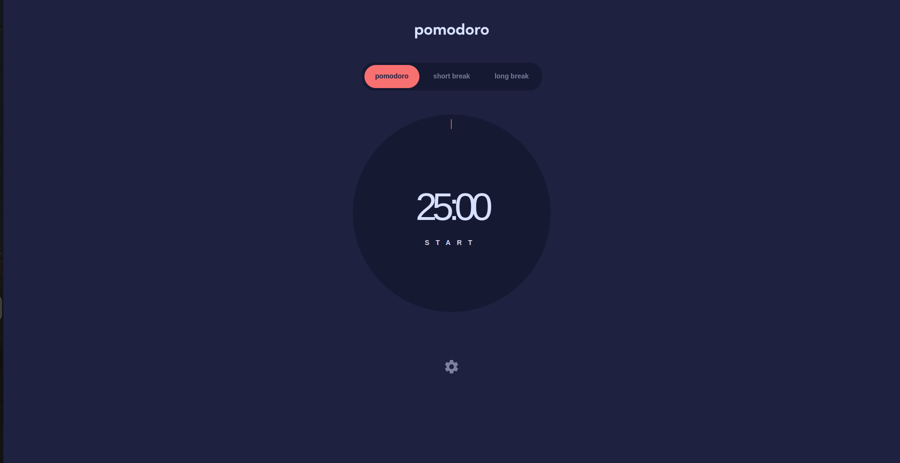

# Frontend Mentor - Pomodoro app solution

This is a solution to the [Pomodoro app challenge on Frontend Mentor](https://www.frontendmentor.io/challenges/pomodoro-app-KBFnycJ6G). Frontend Mentor challenges help you improve your coding skills by building realistic projects.

## Table of contents

- [Overview](#overview)
  - [The challenge](#the-challenge)
  - [Screenshot](#screenshot)
  - [Links](#links)
- [My process](#my-process)

  - [Built with](#built-with)
  - [What I learned](#what-i-learned)
  - [Useful resources](#useful-resources)

- [Author](#author)

## Overview

### The challenge

Users should be able to:

- Set a pomodoro timer and short & long break timers
- Customize how long each timer runs for
- See a circular progress bar that updates every minute and represents how far through their timer they are
- Customize the appearance of the app with the ability to set preferences for colors and fonts

### Screenshot

### Links

- Live Site URL: [Add live site URL here](https://your-live-site-url.com)

## My process

### Built with

- Semantic HTML5 markup
- CSS custom properties
- Flexbox
- Mobile-first workflow
- [React](https://reactjs.org/) - JS library
- [Next.js](https://nextjs.org/) - React framework
- [Tailwind](https://tailwindcss.com/) - For styles

### What I learned

through building the Pomodoro app with Next.js, Tailwind CSS, and Redux, i honed my skills in frontend development, state management, and productivity principles. leveraging these technologies, i created a responsive and visually appealing user interface with seamless transitions between timer modes. this project provided valuable insights into time management techniques and the importance of clear project documentation.

### Useful resources

- (https://stackoverflow.com/) - this resource provided a solution for resolving a specific coding issue i encountered in my project. i found the explanation clear and the suggested pattern highly effective..

- (https://www.figma.com/) - i utilize Figma as my primary design tool for crafting projects, leveraging its intuitive interface and collaborative features.

## Author

- Github - [achiewe](https://github.com/achiewe)
- LinkedIn - [achi mamukashvili](https://www.linkedin.com/in/achi-mamukashvili-721928263/)
